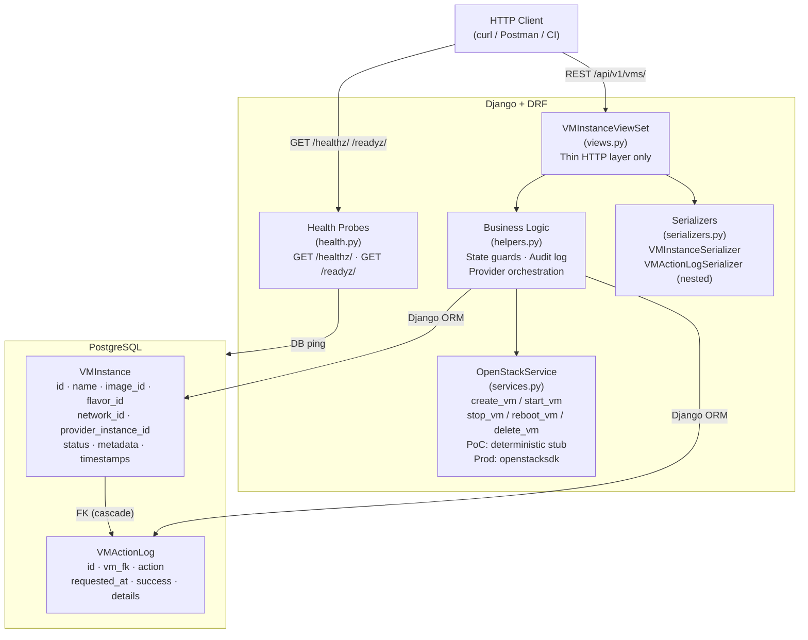
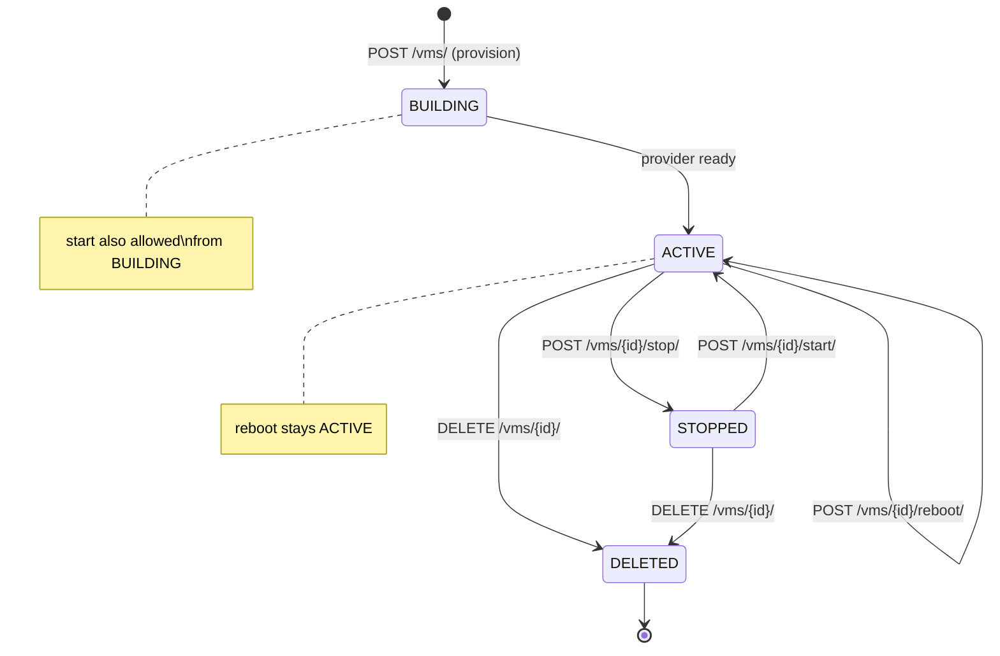
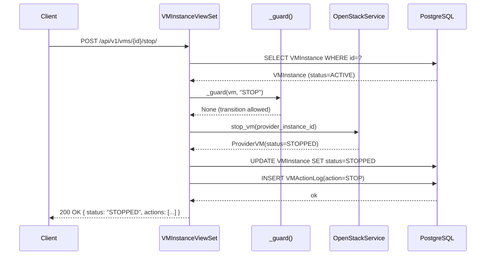

# Architecture and Design Write-up

## Overview

This service exposes a REST API for OpenStack VM lifecycle management.
It is built with **Django + Django REST Framework** (API layer),
**PostgreSQL** (durable state & audit records), and a thin **provider
adapter** that isolates all cloud-SDK calls from business logic.

---

## Component Architecture

---

## VM Lifecycle State Machine

> **Invalid transitions return HTTP 409 Conflict** with a descriptive error message.  
> e.g. calling `start` on an already-`ACTIVE` VM → `409 Cannot perform 'START' on a VM in state 'ACTIVE'`

---

## Request / Response Flow

---

## Key Design Choices

| Decision | Rationale |
|---|---|
| **Adapter pattern** (`OpenStackService`) | Decouples API/persistence from the cloud SDK. Swap the stub for a real SDK client without touching views or models. |
| **`helpers.py` business layer** | Views stay thin (HTTP in/out only). State guards, audit logging, and provider orchestration live in helpers — independently testable and reusable by Celery tasks or management commands. |
| **`@transaction.atomic` on create & delete** | Prevents partial writes — either the DB record *and* the provider call both succeed, or neither is committed. |
| **Append-only `VMActionLog`** | Full audit trail for operational debugging, compliance, and rollback analysis. |
| **`JSONField` for `metadata` & `details`** | Schema flexibility — extensible provider-specific attributes without migrations. |
| **State-transition validation** | Guards against nonsensical operations at the API layer, returning **HTTP 409 Conflict**. |
| **Pagination (default 20)** | `GET /api/v1/vms/` is paginated to prevent unbounded responses at scale. |
| **Structured JSON logging** | Every lifecycle action and state guard rejection is logged in JSON format — drop-in compatible with ELK, Datadog, Cloud Logging. |
| **Health probes `/healthz/` `/readyz/`** | Liveness and readiness checks with no auth required — ready for Kubernetes and load balancer health checks. |
| **SQLite fallback** | `DATABASE_URL` is optional; omitting it allows zero-infrastructure local development. |

---

## Data Model

### `VMInstance`

| Field | Type | Notes |
|---|---|---|
| `name` | CharField (unique) | Human-readable identifier |
| `image_id` | CharField | Cloud image reference |
| `flavor_id` | CharField | Hardware profile reference |
| `network_id` | CharField | Network attachment |
| `key_name` | CharField (optional) | SSH key pair |
| `provider_instance_id` | CharField (unique) | ID returned by the cloud provider |
| `status` | CharField (choices) | `BUILDING / ACTIVE / STOPPED / ERROR / DELETED` |
| `metadata` | JSONField | Extensible key/value store |
| `created_at / updated_at` | DateTimeField | Auto-managed timestamps |

### `VMActionLog`

| Field | Type | Notes |
|---|---|---|
| `vm` | FK → VMInstance | Cascade delete |
| `action` | CharField | `PROVISION / START / STOP / REBOOT / DELETE` |
| `requested_at` | DateTimeField | Auto-set on creation |
| `success` | BooleanField | Default True; set False on provider error |
| `details` | JSONField | Provider response / error payload |

---

## Production Hardening (Roadmap)

- **Real OpenStack integration** — authenticated `openstacksdk` client with region scoping and credential rotation via environment secrets.
- **Async orchestration** — Celery workers for long-running operations, with retry/backoff and dead-letter queues for provider errors.
- **Idempotency keys** — `X-Idempotency-Key` header to safely retry provisioning requests.
- **RBAC** — JWT/OAuth2 bearer-token auth; project/tenant isolation.
- **Observability** — Prometheus metrics (latency, error rates) and distributed tracing via OpenTelemetry.
